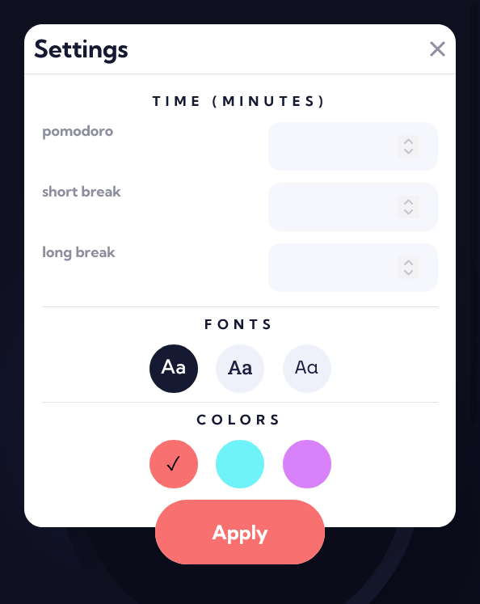
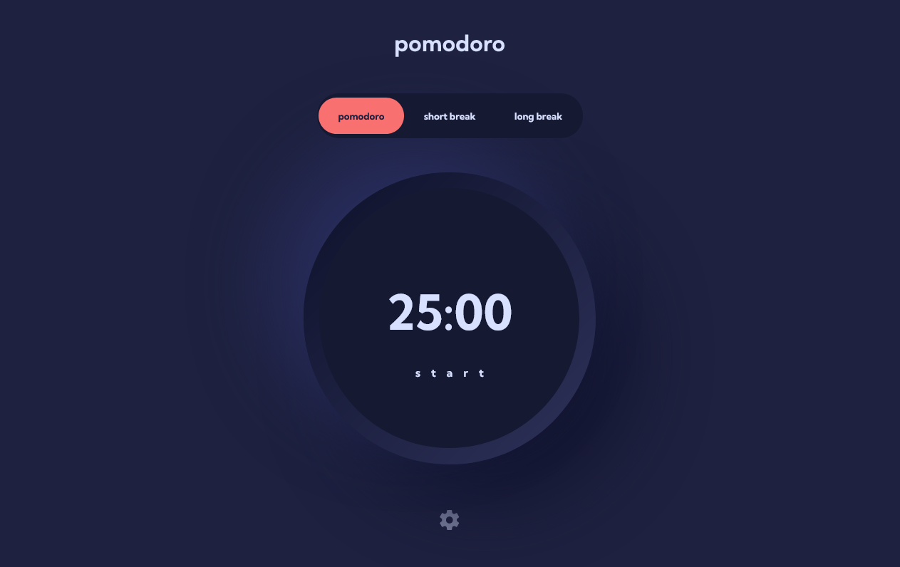

# Frontend Mentor - Pomodoro app solution

This is a solution to the [Pomodoro app challenge on Frontend Mentor](https://www.frontendmentor.io/challenges/pomodoro-app-KBFnycJ6G). Frontend Mentor challenges help you improve your coding skills by building realistic projects. 

## Table of contents

- [Overview](#overview)
  - [The challenge](#the-challenge)
  - [Screenshot](#screenshot)
  - [Links](#links)
- [My process](#my-process)
  - [Built with](#built-with)
  - [What I learned](#what-i-learned)
  - [Continued development](#continued-development)
  - [Useful resources](#useful-resources)
- [Author](#author)

## Overview

### The challenge

Users should be able to:

- Set a pomodoro timer and short & long break timers
- Customize how long each timer runs for
- See a circular progress bar that updates every minute and represents how far through their timer they are
- Customize the appearance of the app with the ability to set preferences for colors and fonts

### Screenshot

### Links

-  [Solution URL:](https://github.com/ArseniyX/repo-pomodoro)
-  [Live Site URL:](https://arseniyx.github.io/repo-pomodoro/)

## My process

### Built with

- Semantic HTML5 markup
- CSS custom properties
- Flexbox
- Mobile-first workflow
- [React](https://reactjs.org/) - JS library
- [Styled Components](https://styled-components.com/) - For styles

**Note: These are just examples. Delete this note and replace the list above with your own choices**

### What I learned

I learned a lot about react, how to use another libraries and how to use 'useRef' hook.

### Continued development

I need to learn using git, and how to write faster with VS code.
Also I need to deal with more libraries.

**Note: Delete this note and the content within this section and replace with your own plans for continued development.**

### Useful resources

- [Countdown timer](https://www.npmjs.com/package/react-countdown) - I used this library for the timer. This library is good but need to make more samples, for how to use it.
- [React Circular Progressbar](https://www.npmjs.com/package/react-circular-progressbar) - I used this library for circular timer and this library is amazing

## Author

- Website - [ArseniyX](https://arseniyx.com)
- Frontend Mentor - [@ArseniyX](https://www.frontendmentor.io/profile/ArseniyX)
